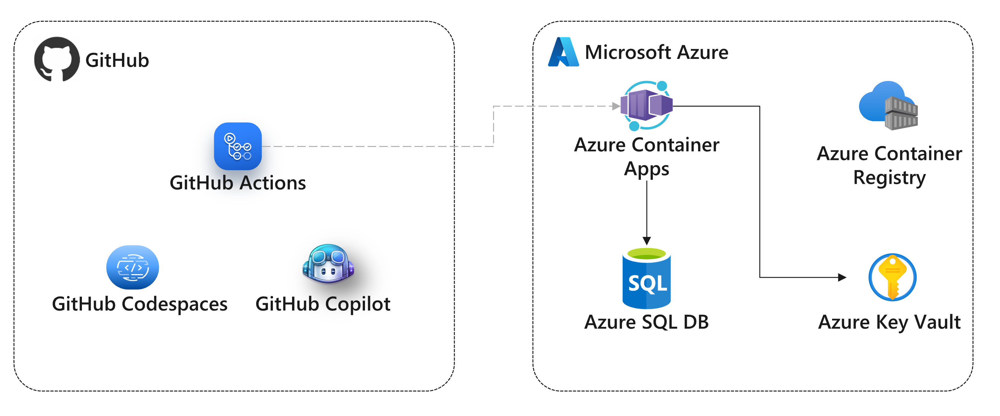

# GitHub Copilot Demo
This repository contains a simple CRUD application, illustrating how Copilot can accelerate developer workflow.

## Application Architecture

### Application Flow
This application is developed in Next.JS, using built-in API route. The API is represented as:
1. Get single transaction
2. Get all transactions
3. Create new transaction
4. Update transaction
5. Delete transaction

### Database schema
All interaction is done via stored procedure in Azure SQL, which is defined. The table schema is as below:

|Table Name | Column| Type| Constraint|
|---|---|---|---|
|[dbo].[transactions]| transaction_id | INT| Primary Key, Auto Increment|
|   | username | NVARCHAR(50)| NOT NULL |
|   | product  | NVARCHAR(50) | NOT NULL |
|   | quantity | INT    | NOT NULL |
|   | transact_date | DATE | NOT NULL|

List of stored procedures:
1. [dbo].[GetAllTransactions]
2. [dbo].[GetTransactionById]
3. [dbo].[InsertTransaction]
4. [dbo].[UpdateTransaction]
5. [dbo].[DeleteTransaction]

## Demo Scenario
The application can only retrieve all transactions from Azure SQL and show results in table. Other actions (Create new transaction, update transaction, delete transaction) are not functioning. The API is not created, and the frontend will only show logs in console that button is clicked.

In this demo, we will showcase how GitHub Copilot learns how I code, and convert code from comment.

### Step 1: Launch in Codespaces
Launch the repo in Codespaces. The Codespaces image is pre-built hence the load up time is fast. Wait till GitHub Copilot logo shows at bottom right corner.

### Step 2: Update API
Open /pages/api/transaction.ts. Comments are provided in line 60 and 61.

Press "Enter", Copilot will start suggest code.

Create API for POST, PUT and DELETE. Copilot will even suggest comments for you.

### Step 3: Update Web UI
Look out for comments with 🔥🔥🔥
Use comment to create fetch request, targetting the backend API created just now.

### Step 4 (Optional): Commit code
This will trigger GitHub actions, and update the application in Azure Container Apps.

### Step 5: Show that application is working
Create new entry, update, and delete the entry. Refresh the browser to shows that the data is inserted into database, not just React State.
